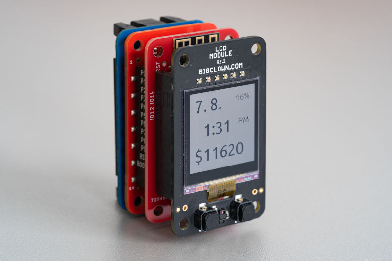

# Firmware for BigClown WiFi Cryptoclock

Displays the current date, time and Bitcoin price in USD.

## Components

* [Battery Module](https://shop.bigclown.com/battery-module/)
* [Core Module - NR](https://shop.bigclown.com/core-module-nr/)
* [WiFi module by chiptron.cz](https://chiptron.cz/articles.php?article_id=182)
* [LCD Module](https://shop.bigclown.com/lcd-module-bg/)

## WiFi module

Use ESP-12E or ESP-12F (optimized PCB antenna) and flash latest [ESP8266 NonOS AT firmware](https://www.espressif.com/en/support/download/at).

You can use other ESP8266 board like NodeMCU or Wemos D1 mini and connect it with wires:

| ESP8266 board | BigClown Core Module |
| --- | --- |
| RX | P2 |
| TX | P3 |
| EN | P8 |
| 3V3 | VDD |
| GND | GND |

## License

This project is licensed under the [MIT License](https://opensource.org/licenses/MIT/) - see the [LICENSE](LICENSE) file for details.

---

Made with &#x2764;&nbsp; by [**HARDWARIO s.r.o.**](https://www.hardwario.com/) in the heart of Europe.
